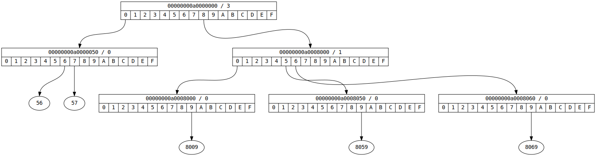
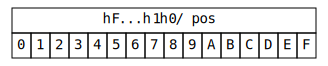
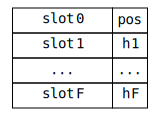
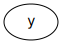
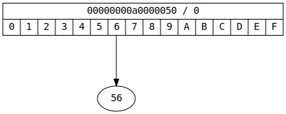
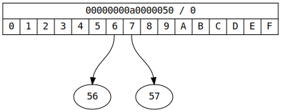
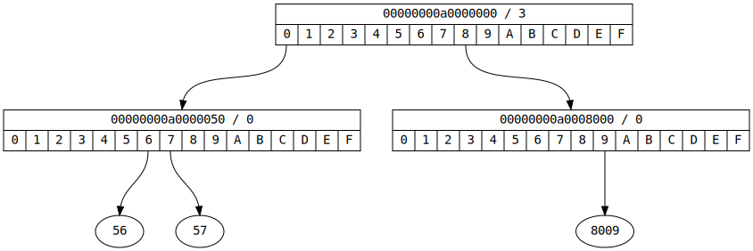

# imap &middot; Integer Map Data Structure

This project presents a new data structure for storing ordered integer maps. An ordered integer map contains _x->y_ mappings, where _x_ and _y_ are integers and where the _lookup_, _assign_ (insert / replace), _remove_ and _iterate_ (in natural numeric order) operations are efficient.

The data structure is a cache-friendly, radix tree that attempts to minimize the number of memory accesses required to compute a result or alter the data structure.

## Definition

An _imap_ is a data structure that represents an ordered 64-bit integer map. The data structure is a tree that consists of nodes, both internal and extenal. Internal nodes store the hierarchical structure of the tree and the _x_ values. External nodes store the _y_ values.

### Internal Nodes

We first observe that a 64-bit integer written in base-16 (hexadecimal) contains 16 digits. We also observe that each digit can take one of 16 values. Thus a 64-bit integer can be written as _hF...h1h0_ where _hi_ is the hexadecimal digit at position _i=0,1,...,F_.

An internal node consists of:

- A prefix, which is a 64-bit integer.
- A position, which is a 4-bit integer.
- 16 pointers that point to children nodes.

The prefix together with the position describe which subset from the set of 64-bit integers is contained under a particular internal node. For example, the prefix _00000000a0008000_ together with position _1_ is written _00000000a0008000 / 1_ and describes the set of all 64-bit integers _x_ such that _00000000a00080**00** <= x <= 00000000a00080**ff**_. In this example, position _1_ denotes the highlighted digit _00000000a00080**0**0_.

In the following graphs we will use the following visual symbol to denote an internal node:

The size of an internal node is exactly 64-bytes, which happens to be the most common cache-line size. To accomplish this an internal node is stored as an array of 16 32-bit integers ("slots"). The high 28 bits of each slot are used to store pointers to other nodes; they can also be used to store the _y_ value directly without using external node storage if the _y_ value can "fit". The low 4 bits of each slot are used to encode one of the hexadecimal digits of the prefix. Because the lowest hexadecimal digit of every possible prefix (_h0_) is always _0_, we use the low 4 bits of slot 0 to store the node position.

### External Nodes

An external node consists of 8 64-bit values. Its purpose is to act as storage for _y_ values (that cannot fit in internal node slots). The size of an external node is exactly 64-bytes.

In the following graphs we do not use an explicit visual symbol to denote external nodes. Rather we use the following visual symbol to denote a single _y_ value:

### Mapping Encoding

Internal nodes with position _0_ are used to encode _x->y_ mappings, which is done as follows. First we compute the prefix of _x_ with the lowest digit set to _0_ (`prfx = x & ~0xfull`). We also compute the "direction" of _x_ at position _0_ (`dirn = x & 0xfull`), which is the digit of _x_ at position 0. The _x->y_ mapping is then stored at the node with the computed prefix with the _y_ value stored in the slot pointed by the computed direction. (The _y_ value can be stored directly in the slot if it fits, or it can be a pointer to storage in an external node if it does not.)

For example, the mapping _x=A0000056->y=56_ will be encoded as:

If we then add the mapping _x=A0000057->y=57_:

Internal nodes with position greater than _0_ are used to encode the hierarchical structure of the tree. Given the node prefix and the node position, they split the subtree with the given prefix into 16 different directions at the given position.

For example, if we also add _x=A0008009->y=8009_:

Here the _00000000a0000000 / 3_ node is the root of the subtree for all _x_ such that _00000000a000**0000** <= x <= 00000000a000**ffff**_. Notice also that the tree need not contain nodes for all positions, but only the positions where the _x_ stored in the tree differ.

### Slot encoding

Slots are 32-bit integers used to encode node and _y_ value information, but also information such as node prefix and position. The lower 4 bits of every slot are used to encode the node prefix and position; this leaves the higher 28 bits to encode node pointer and _y_ value information.

This means that there is a theoretical upper bound of _228=268435456_ to the number of _x->y_ mappings that can be stored in the tree. However the particular implementation in this project uses one slot bit to differentiate between internal and external nodes and one slot bit to denote if a slot contains the _y_ value directly (i.e. without external storage). This brings the theoretical upper bound down to _226=67108864_.

### Lookup Algorithm

### Assign Algorithm

### Remove Algorithm

### Iterate Algorithm

## Implementation

## License

MIT
