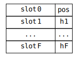
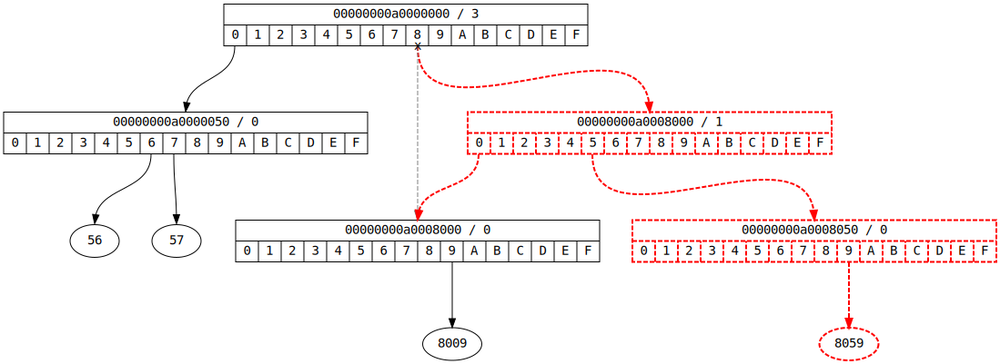

# imap &middot; Integer Map Data Structure


This project presents a new data structure for storing ordered integer maps: a data structure that contains _x->y_ mappings, where _x_ and _y_ are integers and where the _lookup_, _assign_ (insert / replace), _remove_ and _iterate_ (in natural numeric order) operations are efficient.

The proposed data structure is a compressive, cache-friendly, radix tree that attempts to: (1) minimize the number of memory accesses required to manage the data structure,  and (2) minimize the amount of memory storage required to store data. It has performance comparable to an unordered map (`std::unordered_map`) and is an order of magnitude faster than a regular ordered map (`std::map`).

## Motivation

The need to maintain an integer map arises often in programming. Often the integers are used to represent other entities such as symbols (e.g. a `sym->sym` symbolic map), file handles/descriptors (e.g. a `handle->pointer` file map), pointers (e.g. a `pointer->pointer` object map), etc. Integer maps can also be used as a building block for integer sets, floating point maps, interval maps, etc.

If the map is **unordered** and does not need to support a fast _successor_ or _iterate_ operation then usually the best data structure is a hash table employing an open addressing scheme. However there is often a need for **ordered** integer maps with support for a fast _successor_ or _iterate_ operation in natural numeric order. The obvious choice is a tree data structure such as the one provided by `std::map`, which unfortunately do not always have the best performance. Radix trees are an improvement and some forms of radix trees like [crit-bit trees](https://cr.yp.to/critbit.html) can perform better.

The proposed data structure is a radix tree that instead of using a single bit to make a decision whether to go left or right in the tree, it uses 4 bits to pick one of 16 directions. The data structure employs a compression scheme for internal pointers and stored values and is laid out in a cache-friendly manner. These properties have the effect of creating a time and space efficient data structure.

## Definition

An _imap_ is a data structure that represents an ordered 64-bit integer map. The data structure is a tree that consists of nodes, both internal and extenal. Internal nodes store the hierarchical structure of the tree and the _x_ values. External nodes store the _y_ values.

### Internal Nodes

We first observe that a 64-bit integer written in base-16 (hexadecimal) contains 16 digits. We also observe that each digit can take one of 16 values. Thus a 64-bit integer can be written as _h<sub>F</sub>...h<sub>1</sub>h<sub>0</sub>_ where _h<sub>i</sub>_ is the hexadecimal digit at position _i=0,1,...,F_.

An internal node consists of:

- A prefix, which is a 64-bit integer.
- A position, which is a 4-bit integer.
- 16 pointers that point to children nodes.

The prefix together with the position describe which subset from the set of 64-bit integers is contained under a particular internal node. For example, the prefix _00000000a0008000_ together with position _1_ is written _00000000a0008000 / 1_ and describes the set of all 64-bit integers _x_ such that _00000000a00080**00** <= x <= 00000000a00080**ff**_. In this example, position _1_ denotes the highlighted digit _00000000a00080**0**0_.

In the following graphs we will use the following visual symbol to denote an internal node:


The size of an internal node is exactly 64-bytes, which happens to be the most common cache-line size. To accomplish this an internal node is stored as an array of 16 32-bit integers ("slots"). The high 28 bits of each slot are used to store pointers to other nodes; they can also be used to store the _y_ value directly without using external node storage if the _y_ value can "fit". The low 4 bits of each slot are used to encode one of the hexadecimal digits of the prefix. Because the lowest hexadecimal digit of every possible prefix (_h<sub>0</sub>_) is always _0_, we use the low 4 bits of slot _0_ to store the node position.



### External Nodes

An external node consists of 8 64-bit values. Its purpose is to act as storage for _y_ values (that cannot fit in internal node slots). The size of an external node is exactly 64-bytes.

In the following graphs we do not use an explicit visual symbol to denote external nodes. Rather we use the following visual symbol to denote a single _y_ value:


### Mapping Encoding

Internal nodes with position _0_ are used to encode _x->y_ mappings, which is done as follows. First we compute the prefix of _x_ with the lowest digit set to _0_ (`prfx = x & ~0xfull`). We also compute the "direction" of _x_ at position _0_ (`dirn = x & 0xfull`), which is the digit of _x_ at position 0. The _x->y_ mapping is then stored at the node with the computed prefix with the _y_ value stored in the slot pointed by the computed direction. (The _y_ value can be stored directly in the slot if it fits, or it can be a pointer to storage in an external node if it does not.)

For example, the mapping _x=A0000056->y=56_ will be encoded as:


If we then add the mapping _x=A0000057->y=57_:


Internal nodes with position greater than _0_ are used to encode the hierarchical structure of the tree. Given the node prefix and the node position, they split the subtree with the given prefix into 16 different directions at the given position.

For example, if we also add _x=A0008009->y=8009_:


Here the _00000000a0000000 / 3_ node is the root of the subtree for all _x_ such that _00000000a000**0000** <= x <= 00000000a000**ffff**_. Notice that the tree need not contain nodes for all positions, but only for the positions where the stored _x_ values differ.

### Slot encoding

Slots are 32-bit integers used to encode node and _y_ value information, but also information such as node prefix and position. The lower 4 bits of every slot are used to encode the node prefix and position; this leaves the higher 28 bits to encode node pointer and _y_ value information.

This means that there is a theoretical upper bound of _2<sup>28</sup>=268435456_ to the number of _x->y_ mappings that can be stored in the tree. However the particular implementation in this project uses one slot bit to differentiate between internal and external nodes and one slot bit to denote if a slot contains the _y_ value directly (i.e. without external storage). This brings the theoretical upper bound down to _2<sup>26</sup>=67108864_.

### Storage

This data structure attempts to minimize memory accesses and improve performance:

- The tree is compressed along the position axis and only nodes for positions where the stored _x_ values differ are kept.
- The _y_ values are stored using a compression scheme, which avoids the need for external node storage in many cases, thus saving an extra memory access.
- The tree nodes employ a packing scheme so that they can fit in a cache-line.
- The tree nodes are cache-aligned.

Notice that tree nodes pack up to 16 pointers to other nodes and that we only have 28 bits (in practice 26) per slot to encode pointer information. This might work on a 32-bit system, but it would not work well on a 64-bit system where the address space is huge.

For this reason this data structure uses a single contiguous array of nodes for its backing storage that is grown (reallocated) when it becomes full. This has many benefits:

- Node pointers are now offsets from the beginning of the array and they can easily fit in the bits available in a slot.
- Node allocation from the array can be faster than using a general memory allocation scheme like `malloc`.
- If care is taken to ensure that the allocated array is cache-aligned, then all node accesses are cache-aligned.
- Spatial cache locality is greatly improved.

### Lookup Algorithm

The _lookup_ algorithm finds the slot that is mapped to an _x_ value, if any.

```C
    imap_slot_t *imap_lookup(imap_node_t *tree, imap_u64_t x)
    {
        imap_node_t *node = tree;                                       // (1)
        imap_slot_t *slot;
        imap_u32_t sval, posn = 16, dirn = 0;                           // (1)
        for (;;)
        {
            slot = &node->vec32[dirn];                                  // (2)
            sval = *slot;                                               // (2)
            if (!(sval & imap__slot_node__))                            // (3)
            {
                if (!(sval & imap__slot_value__) ||                     // (3.1)
                    imap__node_prefix__(node) != (x & ~0xfull))         // (3.1)
                    return 0;                                           // (3.1)
                IMAP_ASSERT(0 == posn);
                return slot;                                            // (3.2)
            }
            node = imap__node__(tree, sval & imap__slot_value__);       // (4)
            posn = imap__node_pos__(node);                              // (4)
            dirn = imap__xdir__(x, posn);                               // (5)
        }
    }
```

1. Set the current node to the root of the tree. The first node in the tree contains general data about the data structure including a pointer to the root node; it is laid in such a manner so that algorithms like _lookup_, etc. can access it as if it was a regular internal node, which avoid special case code.
2. Given a direction (`dirn`) access the slot value from the current node.
3. If the slot value is not a pointer to another node, then:
    1. If the slot has no value or if the node prefix does not match our _x_ value (which means that this node cannot contain _y_ values for our _x_ value) then return _null_.
    2. Otherwise return the found slot.
4. Compute the new current node and retrieve its position (`posn`).
5. Compute the direction at the node's position from the _x_ value and loop back to (2).

The lookup algorithm will make 16+2=18 lookups in the worst case (no more than 16 lookups to walk the tree hierarchy + 1 lookup for the tree node + 1 lookup for the _y_ value if it is greater or equal to 2<sup>26</sup>). In practice it will do far fewer lookups.

For example to lookup the value _x=A0008009_:


### Assign Algorithm

The _assign_ algorithm finds the slot that is mapped to an _x_ value, or inserts a new slot if necessary.

```C
    imap_slot_t *imap_assign(imap_node_t *tree, imap_u64_t x)
    {
        imap_node_t *newnode, *node = tree;                             // (1)
        imap_slot_t *slot;
        imap_u32_t newmark, sval, diff, posn = 16, dirn = 0;            // (1)
        imap_u64_t prfx;
        for (;;)
        {
            slot = &node->vec32[dirn];                                  // (2)
            sval = *slot;                                               // (2)
            if (!(sval & imap__slot_node__))                            // (3)
            {
                if (0 == posn)                                          // (3.1)
                {
                    IMAP_ASSERT(imap__node_prefix__(node) == (x & ~0xfull));
                    return slot;                                        // (3.1)
                }
                newmark = imap__alloc_node__(tree);                     // (3.2)
                *slot = (*slot & imap__slot_pmask__) | imap__slot_node__ | newmark; // (3.2)
                break;                                                  // (3.3)
            }
            node = imap__node__(tree, sval & imap__slot_value__);       // (4)
            prfx = imap__node_prefix__(node);                           // (4)
            posn = prfx & imap__prefix_pos__;                           // (4)
            diff = imap__xpos__(prfx ^ x);                              // (5)
            if (diff > posn)                                            // (6)
            {
                newmark = imap__alloc_node__(tree);                     // (6.1)
                *slot = (*slot & imap__slot_pmask__) | imap__slot_node__ | newmark; // (6.1)
                newnode = imap__node__(tree, newmark);
                newmark = imap__alloc_node__(tree);                     // (6.2)
                *newnode = imap__node_zero__;
                newnode->vec32[imap__xdir__(prfx, diff)] = sval;        // (6.3)
                newnode->vec32[imap__xdir__(x, diff)] = imap__slot_node__ | newmark;// (6.3)
                imap__node_setprefix__(newnode, imap__xpfx__(prfx, diff) | diff);   // (6.4)
                break;                                                  // (6.5)
            }
            dirn = imap__xdir__(x, posn);                               // (7)
        }
        newnode = imap__node__(tree, newmark);                          // (8)
        *newnode = imap__node_zero__;                                   // (8)
        imap__node_setprefix__(newnode, x & ~0xfull);                   // (8)
        return &newnode->vec32[x & 0xfull];                             // (9)
    }
```

1. Set the current node to the root of the tree.
2. Given a direction (`dirn`) access the slot value from the current node.
3. If the slot value is not a pointer to another node, then:
    1. If the node position (`posn`) is zero, then return the found slot.
    2. Otherwise we must insert a new node with position _0_ to point to the _y_ value. Allocate space for the node and update the current slot to point to it.
    3. Break out of the loop to complete the initialization of the new node.
4. Compute the new current node and retrieve its prefix (`prfx`) and position (`posn`).
5. Compute the XOR difference of the node's prefix and the _x_ value (`diff`).
6. If the XOR difference is greater than the current node's position, then:
    1. We must insert a new node **above** the current node with position equal to the XOR difference. Allocate space for the node and update the current slot to point to it. Let us call this node N<sub>D</sub>.
    2. We must also insert a new node with position _0_ to point to the _y_ value. Allocate space for that node as well. Let us call this node N<sub>0</sub>.
    3. Initialize node N<sub>D</sub> so that one slot points to the current node and one slot points to node N<sub>0</sub>.
    4. Set the node N<sub>D</sub> prefix and position.
    5. Break out of the loop to complete the initialization of node N<sub>0</sub>.
7. Compute the direction at the node's position from the _x_ value and loop back to (2).
8. Initialize new node with position _0_ and set its prefix from the _x_ value.
9. Return the correct slot from the new node.

The _assign_ algorithm may insert 0, 1 or 2 new nodes. It works similarly to _lookup_ and attempts to find the slot that should be mapped to the _x_ value. If the node that contains this slot already exists, then _assign_ simply returns the appropriate slot within that node so that it can be filled ("assigned") with the _y_ value.

For example after running _assign_ for _x=A0000057_:


While traversing the tree the _assign_ algorithm computes the XOR difference between the current node and the _x_ value. If the XOR difference is greater than the current node's position then this means that the tree needs to be restructured by adding two nodes: one node to split the tree at the position specified by the XOR difference and one node with position _0_ that will contain the slot to be filled ("assigned") with the _y_ value.

For example after running _assign_ for _x=A0008059_:



If the XOR difference is always less than or equal to the current node's position, then this means that the _x_ value is contained in the subtree that has the current node as root. If the algorithm finds the bottom of the tree without finding a node with position _0_, then it must insert a single node with position _0_ that will contain the slot to be filled ("assigned") with the _y_ value.

For example after running _assign_ for _x=A0008069_:


### Remove Algorithm

The _remove_ algorithm deletes the _y_ value from the slot that is mapped to an _x_ value. Any extraneous nodes in the path to the removed slot are also removed or merged with other nodes.

```C
    void imap_remove(imap_node_t *tree, imap_u64_t x)
    {
        imap_iter_t iterdata, *iter = &iterdata;
        imap_node_t *node = tree;                                       // (1)
        imap_slot_t *slot;
        imap_u32_t sval, pval, posn = 16, dirn = 0;                     // (1)
        iter->stackp = 0;
        for (;;)
        {
            slot = &node->vec32[dirn];                                  // (2)
            sval = *slot;                                               // (2)
            if (!(sval & imap__slot_node__))                            // (3)
            {
                if (!(sval & imap__slot_value__) ||                     // (3.1)
                    imap__node_prefix__(node) != (x & ~0xfull))         // (3.1)
                    ;                                                   // (3.1)
                else
                {
                    IMAP_ASSERT(0 == posn);
                    imap_delval(tree, slot);                            // (3.2)
                }
                break;                                                  // (3.3)
            }
            node = imap__node__(tree, sval & imap__slot_value__);       // (4)
            posn = imap__node_pos__(node);                              // (4)
            dirn = imap__xdir__(x, posn);                               // (5)
            iter->stack[iter->stackp++] = (sval & imap__slot_value__) | dirn;   // (6)
        }
        while (iter->stackp)                                            // (7)
        {
            sval = iter->stack[--iter->stackp];                         // (8)
            node = imap__node__(tree, sval & imap__slot_value__);       // (8)
            posn = !!imap__node_pos__(node);                            // (9)
            if (posn != imap__node_popcnt__(node, &pval))               // (10)
                break;                                                  // (10)
            imap__free_node__(tree, sval & imap__slot_value__);         // (11)
            if (!iter->stackp)                                          // (12)
                slot = &tree->vec32[0];                                 // (12)
            else
            {
                sval = iter->stack[iter->stackp - 1];                   // (13)
                dirn = sval & 31;                                       // (13)
                node = imap__node__(tree, sval & imap__slot_value__);   // (13)
                slot = &node->vec32[dirn];                              // (13)
            }
            *slot = (*slot & imap__slot_pmask__) | (pval & ~imap__slot_pmask__);// (14)
        }
    }
```

1. Set the current node to the root of the tree.
2. Given a direction (`dirn`) access the slot value from the current node.
3. If the slot value is not a pointer to another node, then:
    1. If the slot has no value or if the node prefix does not match our _x_ value (which means that this node cannot contain _y_ values for our _x_ value) then do nothing.
    2. Otherwise delete the _y_ value from the slot.
    3. Break out of the loop to continue the removal of extraneous nodes.
4. Compute the new current node and retrieve its position (`posn`).
5. Compute the direction at the node's position from the _x_ value.
6. Store the current node pointer and current direction in a stack and loop back to (2).
7. Loop while the stack is not empty.
8. Pop a node from the stack.
9. Compute the node's "boolean" position (_0_ if the node's position is equal to _0_, _1_ if the node's position is not equal to _0_).
10. Compare the node's "boolean" position to the node's population count (i.e. the number of non-empty slots). This test determines if a node with position _0_ has any non-empty slots or if a node with position other than _0_ has two or more subnodes. In either case break the loop without removing any more nodes.
11. Deallocate the node.
12. If we are at the top of the stack we update our `slot` variable to point within the first tree node so that we can update the tree root in the next executed statement.
13. Otherwise we peek at the top of the stack to determine the node that needs to be updated to no longer point to the removed node. We then update our `slot` variable to point to the correct slot within that node.
14. Update the slot and loop back to 7.

The _remove_ algorithm may remove 0, 1 or 2 nodes.

## Implementation

## License

MIT
